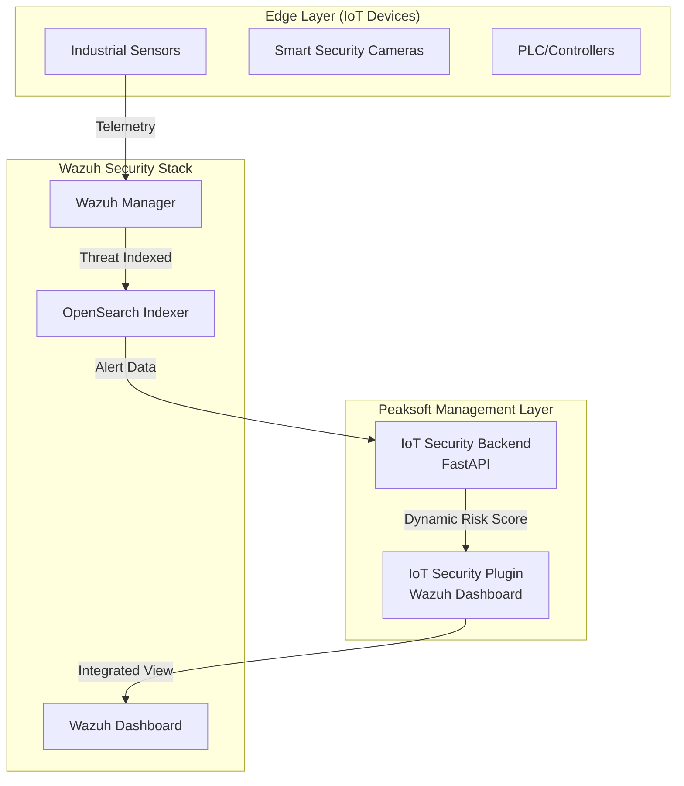

# Peaksoft IoT Security Solution: Client Presentation Guide

This document summarizes the current state, architecture, and live capabilities of the **Peaksoft IoT Cybersecurity Management Solution** to demonstrate value to the client.

---

## 🔝 Executive Summary

The Peaksoft IoT Security module extends the world-class Wazuh SIEM/XDR platform to provide specialized, AI-driven visibility into IoT environments. We have successfully moved from a design phase to a **Live Functional Prototype** that correlates real-world security threats with device inventory.

### Key Value Propositions
- **Unified Visibility**: Managed IoT inventory side-by-side with security alerts.
- **Dynamic Risk Assessment**: Real-time risk scoring based on live security telemetry.
- **Standards Compliance**: Automated mapping to international security standards (IEC 62443).

---

## 🏗️ Solution Architecture

The solution is built on a robust three-layer stack designed for scale and enterprise integration.



---

## 🚀 Live Demo Capability (Phase 1 Complete)

We have successfully implemented **Objective 7.1: AI-Based Vulnerability Management**. This can be demonstrated live to the client right now.

### 🧪 Demonstration Scenario: "Camera Breach Response"
1.  **Baseline**: The "Security Camera 1" shows a **Low Risk (0%)** in the dashboard.
2.  **Simulation**: We trigger a mock "Brute Force" and "Unauthorized Stream Access" attack.
3.  **Result**: The Peaksoft Management Layer queries the Wazuh Indexer, detects the level 12 and 15 alerts, and **instantly updates the Camera's Risk Score to 100%**.

**Demonstration Command for Client:**
```bash
# Triggers the live threat simulation
docker exec iot-security-backend python scripts/simulate_alerts.py
```

---

## 📅 Roadmap to Completion

We are aligning the next development sprints with the client's strategic security objectives.

| Objective | Description | Status |
| :--- | :--- | :--- |
| **7.1** | AI-Based Vulnerability Management | ✅ **COMPLETED** (Live Prototype) |
| **7.2** | AI-Based Communication Interfaces (MQTT/Modbus) | 🕒 In Progress |
| **7.3** | IEC 62443 / ETSI EN 303645 Compliance Checks | 🕒 Planned Next |
| **7.4** | Digital Twin Vulnerability Analysis | 🕒 Planned Q2 |
| **7.5** | Multi-Facility Facility Integration | ✅ **READY** (Global Cluster Support) |

---

## 🛠️ Technology Stack
- **Dashboard**: React, TypeScript, Elastic UI (EUI).
- **Security Engine**: Wazuh 4.10.x.
- **Data Storage**: OpenSearch (Indexer).
- **Backend API**: Python FastAPI.
- **Containerization**: Docker & Kubernetes ready.

---
