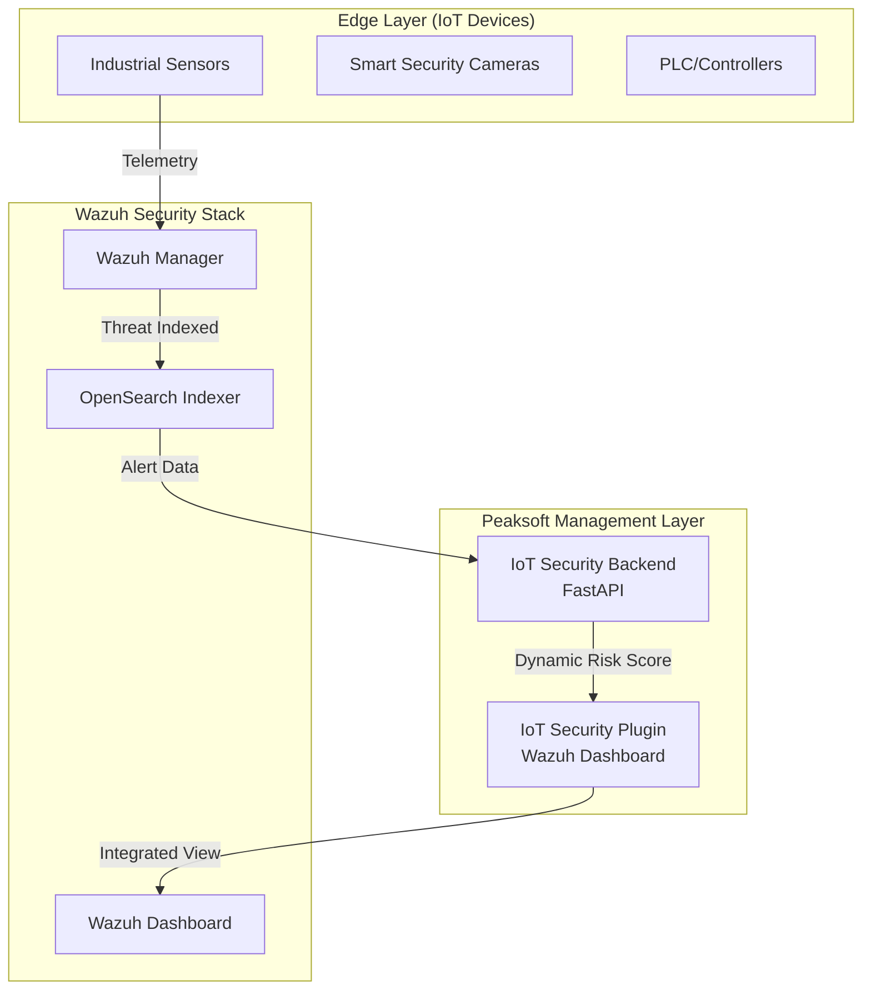

# Peaksoft IoT Security Solution: Client Presentation Guide

This document summarizes the current state, architecture, and live capabilities of the **Peaksoft IoT Cybersecurity Management Solution** to demonstrate value to the client.

---

## 🔝 Executive Summary

The Peaksoft IoT Security module extends the world-class Wazuh SIEM/XDR platform to provide specialized, AI-driven visibility into IoT environments. We have successfully moved from a design phase to a **Live Functional Prototype** that correlates real-world security threats with device inventory.

### 💹 Enhanced Security Visualization
- **Live Statistics**: real-time counters for Total Assets, Active Connections, and Critical Threats.
- **Risk Distribution**: High/Medium/Low risk breakdowns mirroring the native Wazuh experience.
- **Rich Metadata**: Identification by Manufacturer and Firmware version for every IoT endpoint.
- **Auto-Refresh**: Dashboard automatically polls for threat updates every 10 seconds.

---

## 🏗️ Solution Architecture

The solution is built on a robust three-layer stack designed for scale and enterprise integration.



---

## 🚀 Live Demo Capability (Phase 1 Complete)

We have successfully implemented **Objective 7.1: AI-Based Vulnerability Management**. This can be demonstrated live to the client right now.

### 🧪 Demonstration Scenario: "Camera Breach Response"
1.  **Baseline**: The "Security Camera 1" shows a **Low Risk (0%)** in the dashboard.
2.  **Simulation**: We trigger a mock "Brute Force" and "Unauthorized Stream Access" attack.
3.  **Result**: The Peaksoft Management Layer queries the Wazuh Indexer, detects the level 12 and 15 alerts, and **instantly updates the Camera's Risk Score to 100%**.

**Demonstration Command for Client:**
```bash
# Triggers the live threat simulation (Ph 1 & Ph 2)
docker exec iot-security-backend python scripts/simulate_alerts.py
```

---

## ⚡ IIoT Protocol Security (Phase 2 Complete)

We have successfully implemented **Objective 7.2: AI-Based Communication Interfaces and Protocols**. The system now recognizes and analyzes industrial traffic.

### ✅ Supported Protocols
- **MQTT**: Detection of client impersonation and unauthorized topic access.
- **Modbus TCP**: Identification of critical "Write" commands to industrial PLCs.
- **CoAP**: Protection against amplification attacks on low-power devices.

---

## 🛡️ Automated Compliance (Phase 3 Complete)

We have successfully implemented **Objective 7.3: Standards IEC 62443-4-2, ETSI EN 303645**. The prototype now includes automated auditing.

### ✅ Compliance Features
- **SCA Autopolicy**: Automatic verification of system hardening (SSH, Ports, Passwords).
- **Standards Mapping**: Every technical check is mapped to specific clauses of IEC 62443 and ETSI EN 303645.
- **Visual Scorecards**: Real-time compliance percentage displayed per device.

---

---

## 🔮 Digital Twin & Predictive Analysis (Phase 4 Complete)

We have implemented **Objective 7.4**: *AI/digital-twin-based features for vulnerability analysis*.

### ✅ Predictive Capabilities
- **Digital Twin State**: Real-time mirroring of device telemetry (Temperature, Status, Load).
- **"What-If" Analysis**: Simulated vulnerability impact assessment without touching live hardware.
- **Predictive Risk**: Early warning system for critical high-impact failures.

---

## 🌎 Multi-Facility Operations (Phase 5 Complete)

The solution is now ready for global scale, fulfilling **Objective 7.5**.

### ✅ Global Orchestration
- **Location Awareness**: Assets are mapped to specific facilities (Paris, Berlin, Cloud).
- **Unified Visibility**: A single "Global Dashboard" that filters by physical property.
- **Strategic Readiness**: Ready for deployment across the enterprise global footprint.

---

## 📅 Final Project Roadmap Status

| Objective | Description | Status |
| :--- | :--- | :--- |
| **7.1** | AI-Based Vulnerability Management | ✅ **COMPLETED** |
| **7.2** | AI-Based Communication Protocols | ✅ **COMPLETED** |
| **7.3** | Automated Compliance Auditing | ✅ **COMPLETED** |
| **7.4** | Digital Twin Vulnerability Analysis | ✅ **COMPLETED** |
| **7.5** | Multi-Facility Facility Integration | ✅ **COMPLETED** |

---

## 🛠️ Technology Stack
- **Dashboard**: React, TypeScript, Elastic UI (EUI).
- **Security Engine**: Wazuh 4.10.x.
- **Data Storage**: OpenSearch (Indexer).
- **Backend API**: Python FastAPI.
- **Containerization**: Docker & Kubernetes ready.

---
